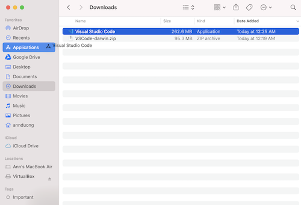
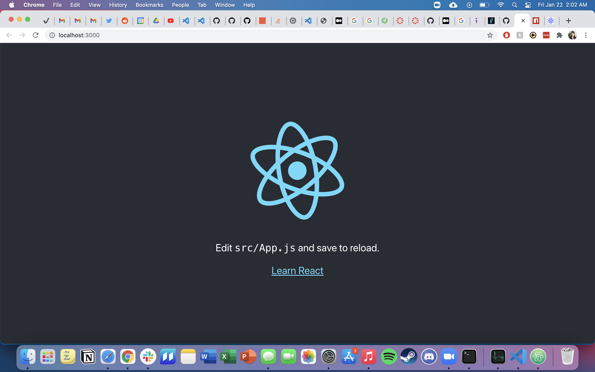

# Local Environment Setup: MacOS

Today, we'll be setting up our local development environment for Mac. For the Windows instructions, see [here](https://github.com/The-Marcy-Lab-School/local-environment-setup-wsl). 

## Table of Contents
1. Download VS Code for Mac and command line tools
2. Set up local Development directory
3. Install Node, NPM, and React
4. Configuring Github with your Terminal
5. Add SSH Key for Github Setup

## Download VS Code
VS Code is a code editor we can use to edit files and write programs. 

1. [Download VS Code for Mac](https://code.visualstudio.com/download)

2. Open up "Finder", navigate to your Downloads folder, click the `.zip` file, then drag Visual Studio Code to your Application folder.



3. Open VS Code and open the Command Palette by typing Shift+Command+P (⇧⌘P). Then type 'shell command' to find the Shell Command: Install 'code' command in PATH command. Click it to install. 


4. If the Shell Command install was successful, you should see this pop-up in the bottom-right of your VS Code:


## Set up local Development directory

1. Open your Terminal. You can so this via Spotlight Search (Command+Spacebar)and type "Terminal":


2. Using your Terminal as a command line, create a folder structure where you can put all your Marcy Lab code. We recommend:
```
Developement
 |- unit-5
 |- unit-6
 |- unit-7
 |- unit-8
```
You can do using the following commands:
* `cd` to navigate to the home directory.
* `ls` to **MAKE SURE** you are in the home directory. You should see folders like "Desktop" and "Documents".
* `mkdir Development` to create a folder for *all* your work.
* `cd Development` where you will create more subdirectories.
* `mkdir unit-5 unit-6 unit-7 unit-8` to make four folders at once.
* `ls` to ensure the folders were created.


3. Lastly, you should be able to type the command `code .` into your terminal and it will open VS Code for you. Remember this terminal command in the future. It will be very helpful!

4. Familiarize yourself with VS Code. This will be your new coding environment. It is very similar to AWS Cloud 9 as long as you **open VS Code via the Terminal** from the **home directory** (you can always navigate to the home directory with `cd` and no path following the command). 

5. Your directories and files are in the left panel. You can start a new "VS Code Terminal" by selecting Terminal from the top menu bar. The "VS Code Terminal" works *exactly* the same as your Mac "Terminal" and your "AWS Cloud9 Terminal"!


## Download Node and NPM

1. [Download Node form their website](https://nodejs.org/en/). Make sure you click on the LTS version Recommended For Most Users. Go through the installation steps. 

2. When you are finished installing, quit and restart your Terminal. Then, type `node -v` and you should not get an error and should see some version number. Type `npm -v` and you should not get an error and should see some version number.

## Download React

1. In your terminal, run `npm install -g create-react-app`. If you get an error, run `sudo npm install -g create-react-app` instead and provide your computer's password. 

2. In the terminal, navigate until you are in the `Development` folder you created. Once you're in the `Development` folder, run `npx create-react-app my-app` and wait until the React project is created. Then run `cd my-app`. Then run `npm start`.

3. You should see the following webpage open in your browser:



4. Now that we've confirmed React is installed, you should delete the folder `my-app` via Finder or the Terminal (`rm -rf my-app`). 

## Configuring Github with your Terminal

1. In either your Mac Terminal or VS Code Terminal, Run the following lines:

```sh
git config --global user.name "Your Name"
git config --global user.email "Your Github Email Address"
git config --global credential.helper store
```

2. Confirm that the configuration was successful by running `git config --global user.name`. The terminal should print out your name. Next, run `git config --global user.email`. The terminal should print our your email address.

## Add SSH Key

While we're configuring GitHub, we should add a new SSH key to allow you to push and pull from Github using SSH. 

1. First, check if you already have an SSH key by running `cat ~/.ssh/id_rsa.pub`. If the terminal prints out a long string of characters starting with ssh-rsa, you've already got a key.

2. If the running previous step printed "No such file or directory", then run `ssh-keygen` to create a key. Leave everything blank and press enter for the default location and no passphrase. You should be prompted to select a file and passphrase for your new key. Leave everything blank and press enter for the default location and no passphrase. If you’re asked if you want to overwrite, then you already have an SSH key, and you do not want to overwrite it. If you've done every correctly, you should be something like this printed to your terminal:


Run `cat ~/.ssh/id_rsa.pub` in your terminal. Copy the output (starting from `ssh-rsa`). You'll need it for the next step

3. Navigate to the homepage of Github in your browser. Go to your account settings:


Click "SSH and GPG Keys":


Click the "New SSH key" button:


Put whatever you want for the title, like "Personal Computer". Paste the key in the text area and click "Add SSH key".


## Confirm that everything is working

At this point, you should be able to clone down, work on, and push back up to Github all of your code. Test all of the following: 

1. Using the terminal, `git clone` one of your old Problem Sets that have tests. Make sure your keep your directory structure clean. You should clone it in an appropriate folder. You can always run `pwd` and `ls` to check where you are. 

2. In the terminal, `cd` into the problem set you just cloned down. Run `npm install`, then run `npm test` to see the test run. 

3. Make a minor change to the `README.md` file of your problem set, add and commit that change, and push it back to Github. Double check using the Internet browser that your change was push to the remote repo. 


### If everything has worked as expected, reach out to Ann for a final validation!!
